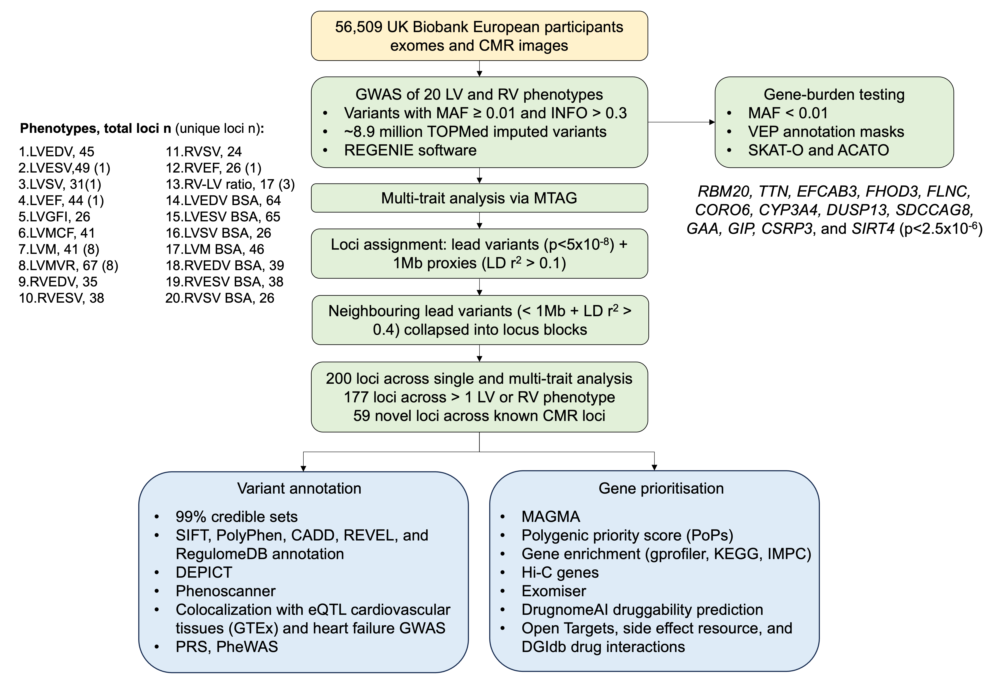

# Common and rare variant contributions to cardiac ventricular phenotypes and their relationships with clinical heart failure

Genome-wide Association Study of CMR left and right ventricular traits

## Introduction

 Left and right ventricular (LV and RV) structure and function measured from cardiac magnetic resonance (CMR) imaging are essential for understanding complex cardiovascular diseases such as heart failure (HF). However, the genetic architecture of LV and RV phenotypes have not been comprehensively explored. 

 In this study, we systematically evaluated the genetic architecture of clinically relevant left and right ventricular imaging traits including novel LV functional parameters by leveraging the TOPMed imputed genotypes and whole exome sequencing (WES) data in up to 56,509 European UK Biobank individuals. Genome-wide association studies (GWAS) performed on 20 LV and RV structural and function traits discovered 200 loci, 59 of which are novel. 

## Methods

Here we perform common and rare genome-wide association analyses (GWAS) of twenty clinically relevant LV and RV phenotypes from CMR images in 56,509 UK Biobank participants.

## Contact

hannahnicholls@qmul.ac.uk